# Github webhook Setup for Discord Bot

This documentation details the process of setting up an integration between Discord and GitHub, enabling seamless communication and automation of key notifications directly within your Discord channels. By connecting your GitHub repository with Discord, you'll be able to receive instant alerts about opened `Pull requests`. This integration facilitates real-time collaboration and keeps your team informed about repository changes, improving efficiency and responsiveness to project updates. The integration needs some configs like generate `discord webhook`, setup a `github webhook` in a repository and create `Personal Access Token` in github profile (PAT)

## Configuration Keys

The following keys, filled it with the information of your configuration:

```
  GITHUB_PR_REVIEW_CHANNEL = DISCORD_CHANNEL_REVIEW
  GITHUB_ACCESS_TOKEN = YOUR_GITHUB_ACCESS_TOKEN
```

- **GITHUB_PR_REVIEW_CHANNEL**: Discord channel where the bot will send PR review messages.
- **GITHUB_ACCESS_TOKEN**: Your access token for authentication (PAT).

> [!NOTE]
> if you want detailed information about this integration process you could check this [doc](https://support.discord.com/hc/en-us/articles/228383668-Intro-to-Webhooks)

- [Configuration Keys](#configuration-keys)
- [Steps to Enable Integration Github Webhook](#steps-to-enable-integration-github-webhook)
  - [1. Generate discord webhook](#1-generate-discord-webhook)
  - [2. Setup Github webhook](#2-setup-github-webhook)
  - [3. Setup Github PAT](#3-setup-github-pat)
  - [4. Setup Discord Bot with collected Information](#4-setup-discord-bot-with-collected-information)

## Steps to Enable Integration Github Webhook

### 1. Generate discord webhook

To enable Discord's Webhook, you need to go to the integrations section in your server settings and obtain Webhook URL where github will send messages about PRs.

#### Steps:

1. Open your Server Settings and head into the Integrations tab
   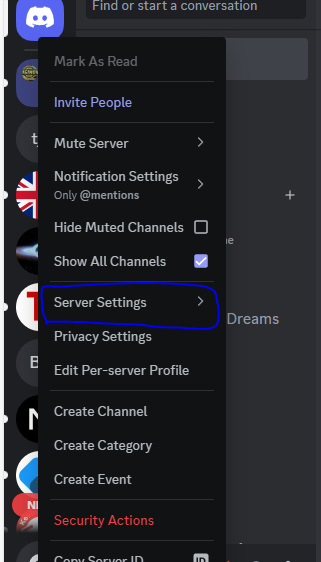

2. Click the "Create Webhook" button to create a new webhook!.
   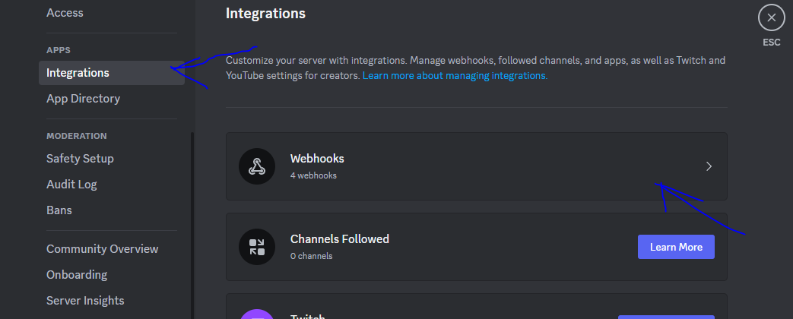

3. Click on "New Webhook" then, there will be a few options to config your webhook like avatar, name and Channel
   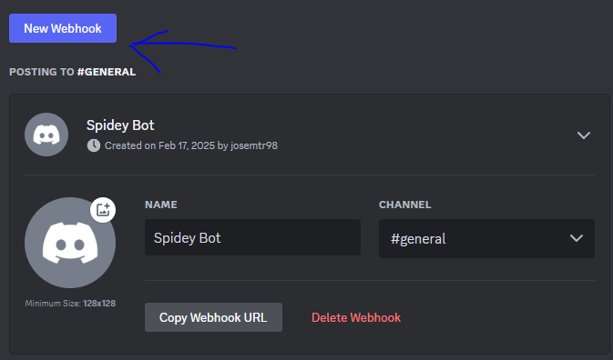

4. Now the URL for your webhook is available to use on the app to receive messages from.

### 2. Setup Github webhook

Once Webhook URL from discord is available you could start with Github settings in the github repository. For more information you could check this [doc](https://docs.github.com/en/webhooks/using-webhooks/creating-webhooks#creating-a-repository-webhook)

#### Steps:

1. On GitHub, navigate to the main page of the repository that will be integrated with webhook. Under your repository name, click Settings. If you cannot see the `Settings` tab, select the dropdown menu, then click Settings.
   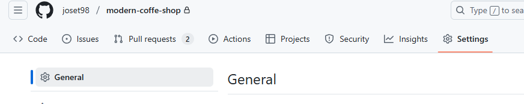

2. Click the `Webhooks` tab in the left sidebar then `add webhook` to start creating new webhook
   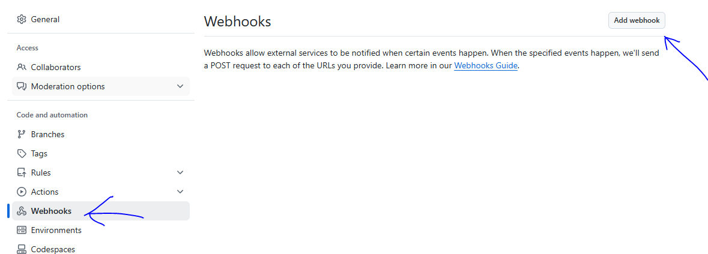

3. In the section under `Payload URL`, type the URL where you'd like to receive payloads (the URL obtained in previous step).

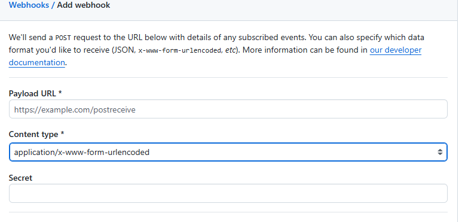

> [!IMPORTANT]
> To make the webhook display messages properly, it's really important that you append `/github` at the end of it. For example: https://discord.com/api/webhooks/123572432467723/abcdef_zdfwewkqlwd--Kto-KB-Kb4kxsFj-BV

4. Optionally, select the Content type drop-down menu, and click a data format to receive the webhook payload in. For this case `application/json` is needed.

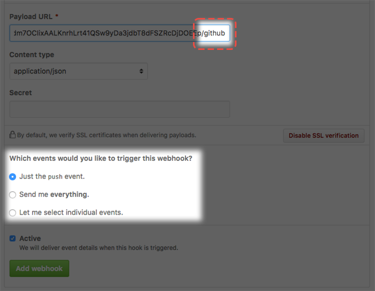

5. Under "Which events would you like to trigger this webhook?", select the webhook events that you want to receive. You should only subscribe to the webhook events that you need in your app. In this case the `Let me select individual events.` option will be enabled to select only the 'Pull request' events.

6. To make the webhook active immediately after adding the configuration, select Active and Click `Add webhook` button.

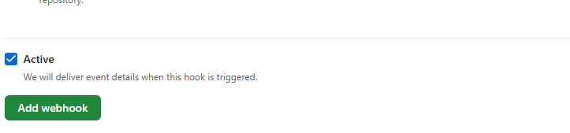

### 3. Setup Github PAT

Personal access tokens are an alternative to using passwords for authentication to GitHub when using the GitHub API or the command line. Personal access tokens are intended to access GitHub resources on behalf of yourself.

> [!NOTE]
> if you want detailed information about this integration process you could check this [documentation](https://docs.github.com/en/authentication/keeping-your-account-and-data-secure/managing-your-personal-access-tokens#creating-a-personal-access-token-classic)

1. In the upper-right corner of any page on GitHub, click your profile photo, then click Settings.
   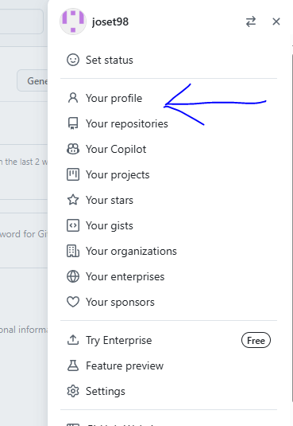

2. In the left sidebar, click Developer settings.
   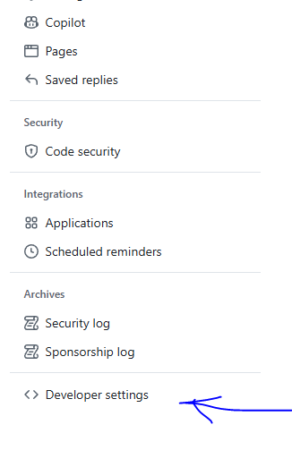

3. In the left sidebar, under PAT tab, click Tokens (classic). Then click `Generate new token` (classic).
   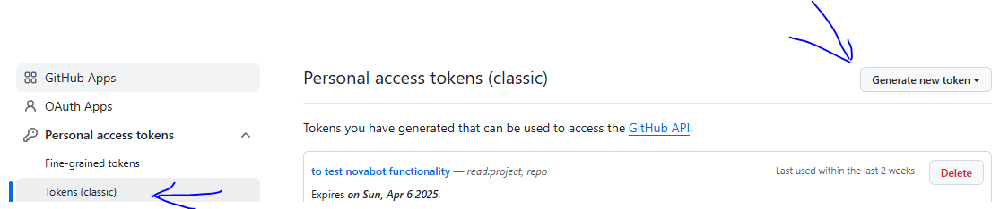

4. In the "Note" field, give your token a descriptive name.

5. To give your token an expiration, select Expiration, then choose a default option or click Custom to enter a date.

6. Select the scopes you'd like to grant this token. To use your token to access repositories from the command line, select repo. A token with no assigned scopes can only access public information. For more information, see Scopes for OAuth apps.

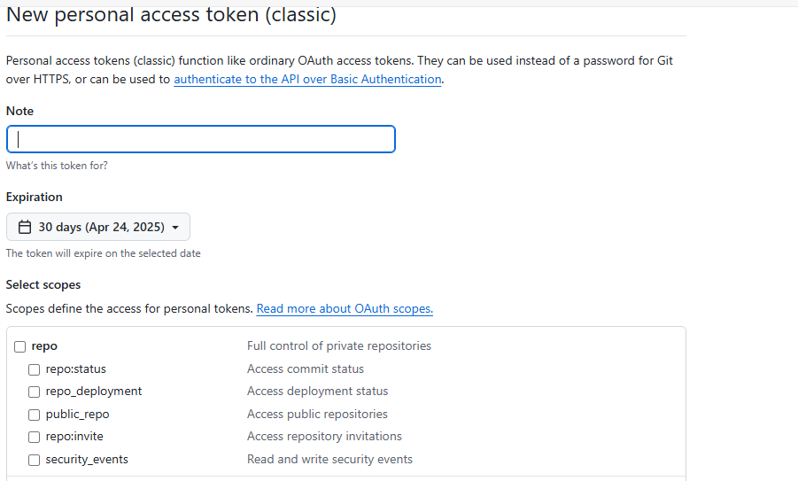

7. Click Generate token. So the token is available for your app now!

### 4. Finalize Discord Bot Configuration

Once the different configurations have been made to connect discord with the github webhook, some of the data obtained is taken to finish with the configuration and integration of the bot.

#### Steps:

1. Configure the PAT obtained from the github profile in the environment variable `GITHUB_ACCESS_TOKEN`

2. The channel that will receive the open PR alert messages is configured by means of the environment variable `GITHUB_PR_REVIEW_CHANNEL`
